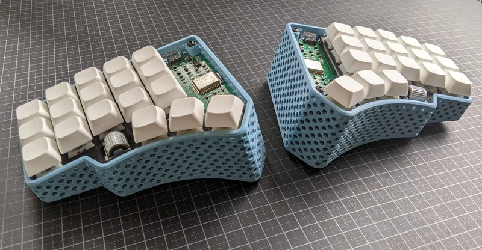
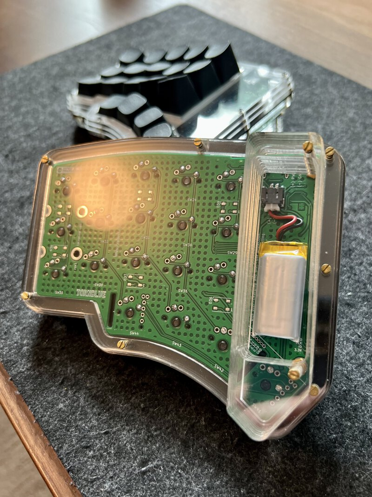

# TornBlue - a bluetooth split keyboard

In this repo you can find information about the TornBlue a bluetooth split keyboard with SMT components. This is an iteration on the [Torn](https://github.com/rtitmuss/torn), which is a split keyboard using through hole components.

You can ask questions and get help on the [Torn Discord channel](https://discord.gg/mamAqNccju).

**WARNING: These files are provided as a reference for designing keyboard PCBs, without liability and without any guarantees regarding functionality. This is untested work in progress, really don't assume anything here will work.**

## Features

- nRF52840 using [zmk](https://zmk.dev/) keyboard firmware
- Battery charging for a 3.7v lithium rechargeable battery (JST-PH connector)
- 6x3 or 5x3 layout with detachable outer column
- 3 leds and 1 charging led
-  ([SOIC test clip footprint](https://hackaday.com/2019/06/13/soicbite-a-program-debug-connector-for-an-soic-test-clip/)) for programming
- Breakout with switchable 3.3v and gpios
- Battery level reported over BT
- Supports soldered Cherry MX compatible or Kailh Choc key switches
- Horizontal reset button (case friendly) 
- JLCPCB PCBA (pcb assembly); handsoldering required for underglow leds and JST-PH connector 

Optional features:

- Underglow leds 
- Optional Panasonic EVQWGD001 wheel encoders

## Parts required

- 2x assembled TornBlue Rev 1 PCBs
- 2x 3.7v lithium rechargeable battery with JST connector. **SAFETY NOTE: Only use a LiIon battery with over-charging and over-use protection. Check the battery polarity before connecting.**
- (Optional) 2x [JST-PH connector](https://www.electrokit.com/en/product/header-ph-2p-2mm-right-angle-smd/). 2mm pitch. Side entry. Surface-mounted.
- (Optional) 2 x [Panasonic EVQWGD001](https://www.aliexpress.com/wholesale?catId=0&initiative_id=SB_20210830111528&SearchText=Panasonic+EVQWGD001) wheel encoder
- (Optional) 12 x [WS2812B 5050 leds](https://www.aliexpress.com/wholesale?catId=0&initiative_id=SB_20210830111716&SearchText=WS2812B)
- (Optional) ST link v2 (or similar) and SOIC-8 test clip for programming the bootloader

## Build instructions

You can find full [build instructions](./build.md), and information for [different cases](./case/README.md).

## Components

The main components are:

- [Holyiot YJ-18010](http://www.holyiot.com/tp/2019042516322180424.pdf); this was chosen as it has castellated edges, which is easier hand soldering the module to the PCB.

- [XC6220](https://www.torexsemi.com/file/xc6220/XC6220.pdf); 3.3V voltage regulator to supply the Holyiot module.

- [TP4096](https://dlnmh9ip6v2uc.cloudfront.net/datasheets/Prototyping/TP4056.pdf) Li-Ion Battery Charger 

- [SRV05-4](https://www.onsemi.com/pdf/datasheet/srv05-4-d.pdf) ESD protection for the USB port
   
 - Other parts use 0805 and SOT-23 packages. These larger packages can be hand soldered and are similar sizes for a pleasing appearance. The parts have been laid out horizontally with a consistent polarity to simplify assembly.

## Reference designs

The following projects were used as reference designs.

- [ZMK hardware design guide](https://github.com/ebastler/zmk-designguide) (CERN Open Hardware Licence Version 2 - Permissive) - note the battery charging circuit might be unsafe, see this information about [TP4056](https://www.best-microcontroller-projects.com/tp4056.html)

- [isometria75](https://github.com/ebastler/isometria-75/tree/v2) (BSD 2-Clause License)

- [Unified USB type-C PCB](https://github.com/ebastler/unified-usb-pcb) (BSD 2-Clause License)

- [Nice!Nano](https://nicekeyboards.com/docs/nice-nano/pinout-schematic)

- [nRFMicro](https://github.com/joric/nrfmicro/wiki) (Public domain)

- [Adafruit nRF52840](https://learn.adafruit.com/introducing-the-adafruit-nrf52840-feather/downloads) (Creative Commons Attribution, Share-Alike)

## Showcase

