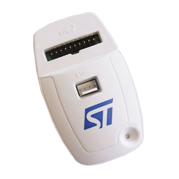
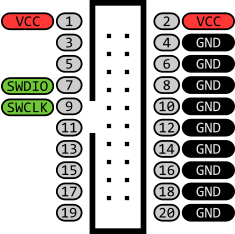

# Bootloader

There are main options for programming nRF52540 boards, and these are well documented at [https://github.com/joric/nrfmicro/wiki/Bootloader](https://github.com/joric/nrfmicro/wiki/Bootloader). To program the tornblue I used a ST-Link/V2 with the Blackmagic firmware on OS X.

## Installing the blackmagic firmware
To install the blackmagic firmware on the ST-Link/V2 you need to first download and compile the following tool and firmware:

-   [https://github.com/UweBonnes/stlink-tool/tree/stlinkv21](https://github.com/UweBonnes/stlink-tool/tree/stlinkv21)
-   [https://github.com/blacksphere/blackmagic/tree/master/src/platforms/stlink](https://github.com/blacksphere/blackmagic/tree/master/src/platforms/stlink)

Install the blackmagic firmware on the ST-Link/V2 using:

	$ ./stlink-tool/stlink-tool blackmagic/src/blackmagic.bin
	Firmware version : V2J31S7 
	Loader version : 14152 
	ST-Link ID : 52FF68064885555248171987 
	Firmware encryption key : A32E6E6E82ADAF7D99EBD574CB4C784D 
	Current mode : 1 Loaded firmware : blackmagic/src/blackmagic.bin, size : 97332 bytes 
	................................................................................................

# Tornblue bootloader

Like many ZMK boards Tornblue uses the Adafruit_nRF52_Bootloader. I modified this for tornblue so that one LED is enabled in the bootloader. You can download this version from [https://github.com/rtitmuss/Adafruit_nRF52_Bootloader](https://github.com/rtitmuss/Adafruit_nRF52_Bootloader).

Compile the bootloader using:

	$ make BOARD=tornblue

You can find the compiled bootloader at:

	_build/build-tornblue/tornblue_bootloader-0.6.3-49-gbfd3b24.out

# Connecting the programmer

You can connect the programmer to the tornblue using a SOIC connector. Connect the SWD pads on the PCB to the 20 pin JTAG header on the ST-Link/V2 as follows:  

|PCB SWD|ST-Link/V2  |  
|--|--|  
|3.3V|VCC Pin 1|  
|SWD IO|SWDIO Pin 7|  
|SWD CLK|SWCLK Pin 9|  
|GND|GND Pin 8|

The pinout on the ST-Link/V2 20 pin JTAG header is:

# Programming the bootloader

You always need to setup the ST-Link/V2 after it has been powered up using:

    ./stlink-tool/stlink-tool 

When the ST-Link/V2 is first connected all the three green LEDs on the Tornblue may all be lit.

You can first check the that board is correctly connected using `swdp_scan` as shown below. You may need to update the /dev path.

    $ arm-none-eabi-gdb --batch -ex "target extended-remote /dev/cu.usbmodem14101" -ex "mon swdp_scan"
    Target voltage: 3.30V
    Available Targets:
    No. Att Driver
     1      Nordic nRF52 Access Port (protected)
     
You can then program the bootloader, using:

    $ arm-none-eabi-gdb --batch -ex "target extended-remote /dev/cu.usbmodem14101" -ex "mon swdp_scan" -ex "file tornblue_bootloader-0.6.3-48-gcc8ea2b_s140_6.1.1.hex" -ex "att 1" -ex "mon erase" -ex load
    Target voltage: 3.30V
    Available Targets:
    No. Att Driver
     1      Nordic nRF52 Access Port (protected) 
    warning: while parsing target description: no element found
    warning: Could not load XML target description; ignoring
    warning: while parsing target memory map (at line 1): Required element <memory> is missing
    0xbfefed14 in ?? ()
    Loading section .sec1, size 0xb00 lma 0x0
    Loading section .sec2, size 0xf000 lma 0x1000
    Loading section .sec3, size 0x10000 lma 0x10000
    Loading section .sec4, size 0x5de8 lma 0x20000
    Loading section .sec5, size 0x85b4 lma 0xf4000
    Loading section .sec6, size 0x58 lma 0xfd800
    Loading section .sec7, size 0x8 lma 0x10001014
    Start address 0xfafcc, load size 188156
    Transfer rate: 418 KB/sec, 969 bytes/write.
    [Inferior 1 (Remote target) detached]

I found that I needed to program the bootloader twice for it to be successful.

    $ arm-none-eabi-gdb --batch -ex "target extended-remote /dev/cu.usbmodem14101" -ex "mon swdp_scan" -ex "file tornblue_bootloader-0.6.3-48-gcc8ea2b_s140_6.1.1.hex" -ex "att 1" -ex "mon erase" -ex load
    Target voltage: 3.30V
    Available Targets:
    No. Att Driver
     1      Nordic nRF52 M4
     2      Nordic nRF52 Access Port 
    0xfffffffe in ?? ()
    erase..
    Loading section .sec1, size 0xb00 lma 0x0
    Loading section .sec2, size 0xf000 lma 0x1000
    Loading section .sec3, size 0x10000 lma 0x10000
    Loading section .sec4, size 0x5de8 lma 0x20000
    Loading section .sec5, size 0x85b4 lma 0xf4000
    Loading section .sec6, size 0x58 lma 0xfd800
    Loading section .sec7, size 0x8 lma 0x10001014
    Start address 0xfafcc, load size 188156
    Transfer rate: 31 KB/sec, 959 bytes/write.
    [Inferior 1 (Remote target) detached]

When the booloader has been successfully installed then the a single green LED will be lit.
